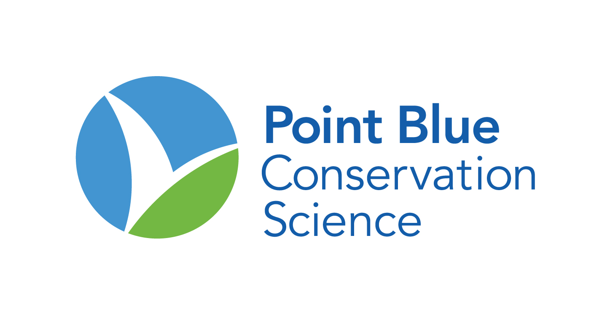

TomKat State of the Ranch Data Pages
=========================
[Point Blue Conservation Science](http://www.pointblue.org) has partnered with [TomKat Ranch](https://tomkatranch.org) to collect many different types of data reflecting changing conditions on the ranch. Every year, we summarize these data and provide Ranch staff with an update. The update including data through fall 2018 is currently underway.This project contains the data and code for producing these data summaries. 

This page serves as an index to the individual ranch data pages. Links will be updated as they are completed:

* [index](https://pointblue.github.io/TomKat/)
* weather
* soil
* vegetation
* water
* birds
* management